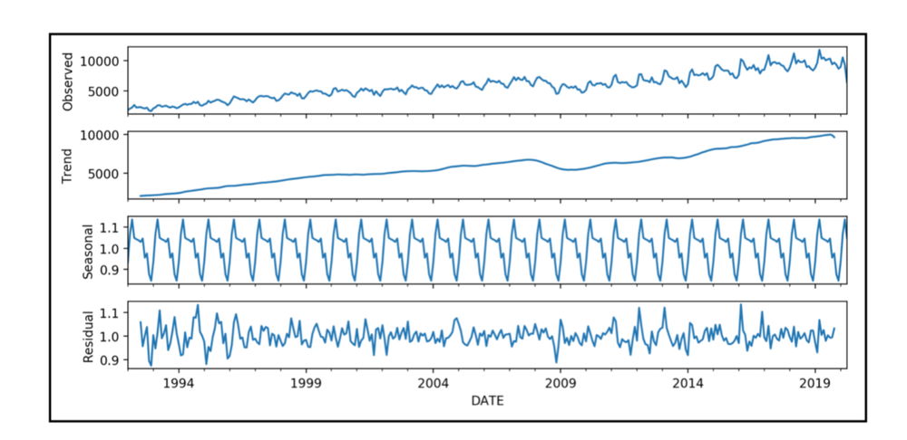

# Timeseries analysis (TSA) 
Set of analytical and numerical technique for the identification of patterns in time sequential data including trends, seasonalities and irregularities. The goal of TSA should be that of modelling and understanding the underlying structure of the timeseries in the form of a stochastic process.

The by-product of TSA is the decomposition of a timeseries in deterministic trend and seasonality and its noisy residuals.

Key methodologies include [but not limited to](https://en.wikipedia.org/wiki/Time_series#Methods_for_analysis):
- moving averages; 
- exponential smoothing; 
- decomposition methods (ARIMA).

__Trends__: At the heart of time series analysis is the identification of trends over a period, typically through rolling aggregates that smooth out short-term fluctuations to reveal a long-term trend.

__Seasonality__: Seasonality captures the repetitive and cyclical patterns in your data, occurring at regular intervals. Identifying these patterns is vital as they offer insights into predictable changes. Integrating your contextual knowledge about the dataset can greatly aid in making sense of these seasonal behaviors.

Model of the remaining noise aka the __residuals__: After accounting for trend and seasonality, the “noise” remains—the part of the data not explained by the model. Analyze this noise by taking your data modulo trend and seasonality to inspect its behavior. Ideally, it should exhibit a stationary distribution, meaning it appears somewhat chaotic but has a stable average and variance over time.

With a stationary noise distribution, you can apply statistical heuristics, such as calculating the average and variance, to make future projections. These estimates can serve as a basis for more complex forecasting. For a more detailed analysis, you might explore stochastic models like Brownian motion. These models account for randomness and can provide more nuanced insights into how your time series data might evolve.

Once we decompose the series, we can explain what each component represents in the real world and, perhaps, what caused it.

Integrating your understanding of the data’s context is crucial throughout each step of your analysis. Whether industry-specific knowledge or familiarity with specific patterns, this insight will help refine your models and projections, leading to more accurate and meaningful models.

## Examples
* __??__
  > ??

* __??__
  > ??
